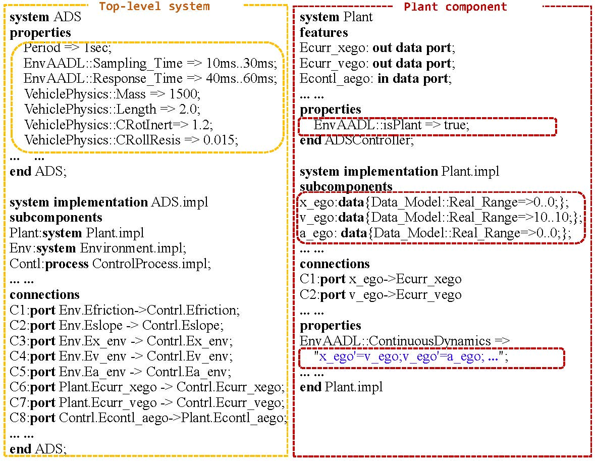
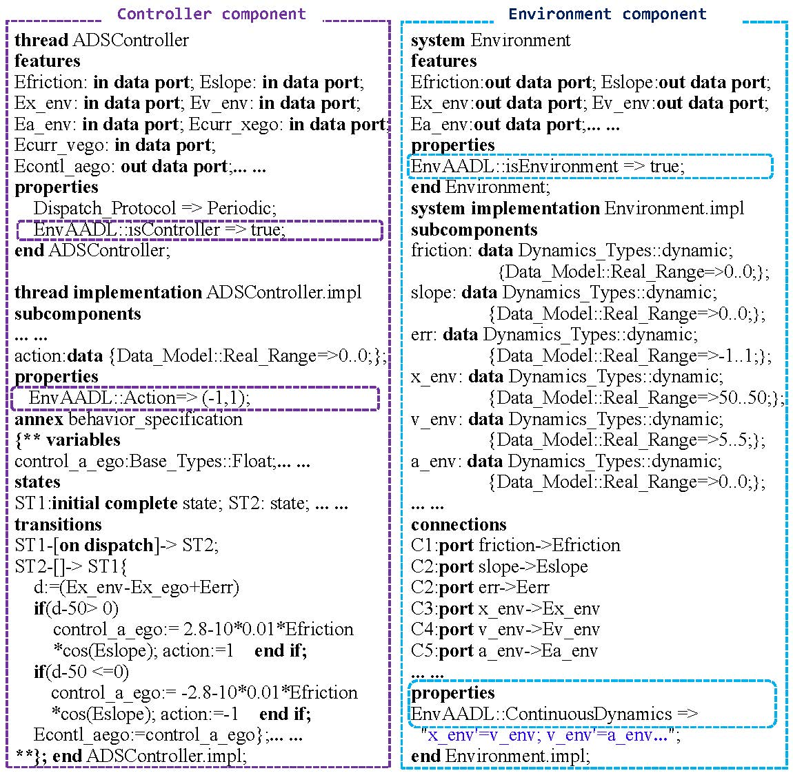
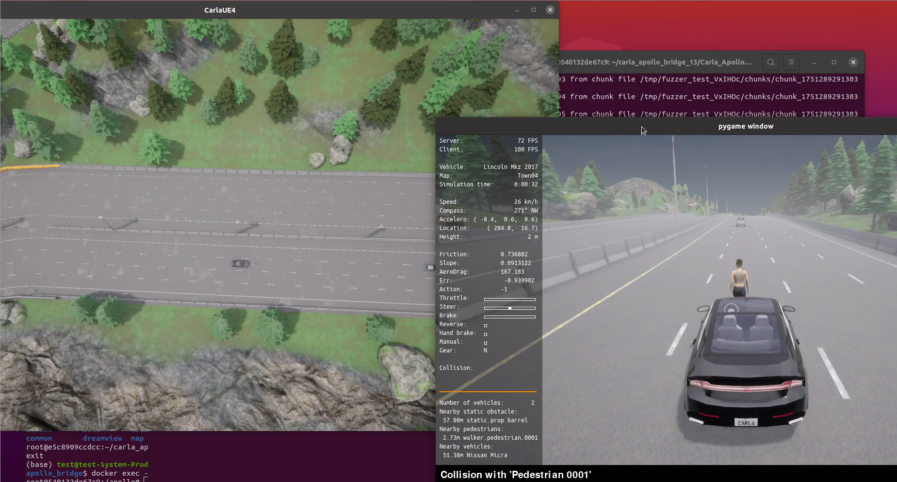
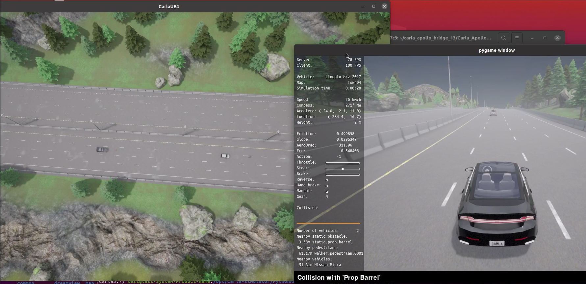

# A STPA-Guided SOTIF Assessment of Real-Time Autonomous Driving Behavior in Uncertain Environments

This repository presents a new SOTIF(Safety Of The Intended Functionality) assessment tool for ADS----SOTIFA. It can systematically evaluate the SOTIF risk of different design models of ADS(Automated Driving System) under an uncertain environment.

## Overview


- The method systematically evaluates the safety of autonomous vehicles in open and uncertain environments, quantifying the ADS **SOTIF risk**.To enhance SOTIF evaluation adaptability, we extend the property set **"EnvAADL"**, which captures hybrid external dynamic environments. Engineers can use EnvAADL (Environmental Architecture Analysis and Design Language) to develop and understand ADS efficiently, supplement key information in existing AADL models, and reuse them for assessment. To address the huge state space caused by continuous behaviors and uncertain environments, we provide efficient ERV (EUCA Risk Value) mechanisms for quantification, enabling **SOTIFA** to perform end-to-end SOTIF assessment based on STPA (Systems-Theoretic Process Analysis).


## Installation:

We conducted the experiment using the tool chain under the following environments. We hope it can work under other operating systems and tool versions as well.

- Operating System: Ubuntu 22.04.2
- Pre-installed software:
  - [java 17.0.8](https://www.oracle.com/java/technologies/downloads/#java17)
  - [osate2-2.11.0](https://osate-build.sei.cmu.edu/download/osate/stable/2.11.0/products/)
  - [Neo4j 5.10.0(COMMUNITY)](https://neo4j.com/deployment-center/#releases)

SOTIFA uses the environment above. After installing the tools, we also need to import the information we need:

- **Copy lib to /usr/lib**

```
sudo cp -r lib/* /usr/lib/
```

- **Import the Knowledge Graph**

Navigate to the 'bin' directory within the installation directory of Neo4j.
```
./neo4j-admin database load --from-path=/home/cxy/SOTIFATools neo4j --overwrite-destination=true
neo4j start
```
- Replace `/path/to/neo4j` with the actual Neo4j path.
- Set USER as `neo4j`, PASSWORD as `12345678`.

- **Install the EnvAADL plugin on OSATE2**

```
Help -> install new Software -> Add -> Local ->SOTIFASite
```
## Running SOTIFA:


This guide provides an overview of how to use SOTIFA for assessing SOTIF risks in autonomous driving systems (ADS). Ensure all dependencies are installed before proceeding.


#### 1. 📐 EnvAADL Modeling

Import the `env-self-driving-car/` project or create your own.

- The system consists of hybrid automata extracted from plant, controller, and environment components.




##### 🔧 Main Components

- **Plant Component**  
  Models the ego car’s dynamics with initial values (like `x_ego = 0`, `v_ego = 10`, `a_ego = 0`).

- **Environment Component**  
  Defines external factors (e.g., friction, slope) and dynamic actors (e.g., environmental vehicles).

- **Controller Component**  
  Samples ego car and environmental parameters, then calculates acceleration to maintain a safe distance from the preceding vehicle.

> **Note:** ***perception modeling***. Crucially, this component also formalizes how variable atmospheric conditions, such as weather and visibility, impact the perception system. To achieve this, the component interfaces with a knowledge graph that maps specific conditions (e.g., ‘visibility<50') to quantifiable perception error magnitudes. This allows the framework to dynamically generate a realistic perception_error value, which is then used by the vehicle's control model to simulate how real-world environmental effects can lead to potential SOTIF-related risks.

---

#### 2. 📉 SOTIF Assessment

Run the assessment:

- Click `SOTIFA` → `SOTIF assessment under uncertain environment` to analyze risks.


The middle panel displays the EnvAADL model code for the ADS in the illustrated case (Sec. II-B). The assessment process begins with `SOTIFA` performing static checks to ensure EnvAADL syntax compliance. Users initiate the assessment by selecting `SOTIFA` → `SOTIF assessment under uncertain environment` at the top, prompting the tool to parse the `EnvAADL` file and update the right panel with the hazard analysis tree and the SOTIF risk score (Sec. VI). Upon running the assessment, an `EnvAADLAnalysis` folder is generated on the left, containing intermediate analysis files, including automata files extracted from `EnvAADL` (Sec. IV-B), EUCAs-based specification files (Sec. V), and final analysis results in the `analysisResults` folder, which contains the hazard analysis tree annotated with scores (Sec. VI).


## Structures:

```
SOTIFA
├──SOTIFA Installation_Usage Videos
│      ├── SOTIFA Installation.mp4
│      └── SOTIFA Usage.mp4
├──CARLA-based_Reproduction
│      ├── Case1_Random_Actor
│      ├── Case2_Static_Actor
│      ├── Script_Code
│      └── Video
└── SOTIFATools
│      ├── lib
│      ├── SOTIFASite
│      └── neo4j.dump
└── env-self-driving-car
│        └── case-study
│        │    ├── ADSHighAggressive.aadl
│        │    └── ADSLowAggressive.aadl
│        └── EnvAADL
│        └── EnvAADLAnalysis
└── Supplementary_Discussion.pdf
└── README
```


#### 🧪Case Studies - `env-self-driving-car`

> #### ADSHighAggressive
>
>> The system completely disregards emergency braking and adherence to traffic regulations, maintaining a distance of 10 from the preceding vehicle.
>>
>> **Model**: `ADSHighAggressive.aadl`
>>
>> **Generated Automata**: `ADSHighAggressiveProduct.xml`
>
> ---
>
> #### ADSLowAggressive
>
>> The system considers emergency braking and adherence to traffic regulations, decelerating at a distance of 30 from the preceding vehicle. The system is refined by optimizing acceleration and deceleration controls.
>>
>> **Model**: `ADSLowAggressive.aadl`
>>
>> **Generated Automata**: `ADSLowAggressiveProduct.xml`


#### 🔁 CARLA-based Reproduction

We reproduce unsafe scenarios in CARLA by injecting counterexample traces generated from **EnvAADL** models. Each case includes environmental parameters (e.g., friction), environmental actors, and initial system states.

- Case1: Random Actor
- 
- Case2: Static Actor
- 
 
### 🧠 Knowledge Graph Construction

We construct a knowledge graph to formalize causal links from traffic losses to unsafe actions:

- A reported loss (e.g., *Loss of life*) is modeled as a `Loss` node.
- A related hazard (e.g., *Vehicle exceeds speed limit*) becomes a `Hazard` node, linked via `Caused_by`.
- Hazards are formalized into `UnsafeSystemConstraint` nodes (e.g., `v_ego > vmax`), using environment and ego vehicle parameters.
- Vehicle actions (e.g., continous acceleration) are linked to constraints via `provide` edges.
- Environmental factors (e.g., `Visibility < 50`) are modeled as `EnvFactor` nodes that influence `EnvFactorParam` such as `vmax`.

### 📊 Statistical Significance and Sensitivity Analysis

We conducted 15 independent runs per configuration (TB1–TB4, IDM1–IDM4, OVM1–OVM4) to assess risk. Wilcoxon signed-rank tests show significant differences (p < 0.05) across all model pairs. Bootstrap analysis provides mean risk scores and 95% confidence intervals.

### Table: Statistical Comparison of Risk Scores

| **Model ID** | **Mean (95% CI)**                  | **Significance ($p$)**      |
|--------------|------------------------------------|------------------------------|
| TB1          | 0.679635 (0.679085, 0.680160)      | vs TB2–4: < 0.05             |
| TB2          | 0.382802 (0.382654, 0.382951)      | vs TB1,3,4: < 0.05           |
| TB3          | 0.697054 (0.696816, 0.697323)      | vs TB1,2,4: < 0.05           |
| TB4          | 0.518920 (0.518791, 0.519054)      | vs TB1–3: < 0.05             |
| IDM1         | 0.382099 (0.381824, 0.382391)      | vs IDM2–4: < 0.05            |
| IDM2         | 0.423404 (0.423340, 0.423470)      | vs IDM1,3,4: < 0.05          |
| IDM3         | 0.393224 (0.393099, 0.393360)      | vs IDM1,2,4: < 0.05          |
| IDM4         | 0.402253 (0.402144, 0.402375)      | vs IDM1–3: < 0.05            |
| OVM1         | 0.389187 (0.389053, 0.389333)      | vs OVM2–4: < 0.05            |
| OVM2         | 0.494473 (0.494357, 0.494583)      | vs OVM1,3,4: < 0.05          |
| OVM3         | 0.472183 (0.471796, 0.472538)      | vs OVM1,2,4: < 0.05          |
| OVM4         | 0.422130 (0.421958, 0.422319)      | vs OVM1–3: < 0.05            |


### ⚙️ Sensitivity of SOTIFA Formula

Three parameters involved in  **EUCA Risk Value (ERV)** 
Here, the parameters are defined as:

- `k₁ = 1.57` (approximation of π/2 for tangent)
- `k₂ = 1.5`
- `k₃ = 10`

We apply ±20% variation to test the robustness of the formula across four ADS configurations (TB1–TB4).

##### 🔬 Sensitivity Results

| **k₁** | **k₂** | **k₃** | **TB1**   | **TB2**   | **TB3**   | **TB4**   |
|--------|--------|--------|-----------|-----------|-----------|-----------|
| 1.57   | 1.5    | 10     | 0.679635  | 0.382802  | 0.697054  | 0.518920  |
| 1.30   | 1.5    | 10     | 0.682470  | 0.384439  | 0.702480  | 0.526112  |
| 1.57   | 1.3    | 10     | 0.677391  | 0.379611  | 0.696454  | 0.516535  |
| 1.57   | 1.5    | 8      | 0.675791  | 0.376590  | 0.691530  | 0.513414  |
| 1.57   | 1.7    | 12     | 0.680553  | 0.385474  | 0.699097  | 0.520160  |

The SOTIFA scores remain stable under moderate parameter changes, showing robustness in identifying high-risk ADS configurations.


### SOTIFATools

- `SOTIFASite`: SOTIFASite plug-in files can be installed.  
- `lib`: The required libraries of the assessment.  
- `neo4j dump`: The knowledge graph.

### Additional Resources

- Installation and usage videos are available:  
  - `SOTIFA Installation.mp4`  
  - `SOTIFA Usage.mp4`  
- Supplementary_Discussion.pdf
